---
## Author
author:
  name: Цыпин Дмитрий Алексеевич
  degrees: DSc
  orcid: 0000-0002-0877-7063
  email: 1032253633@pfur.ru
  affiliation:
    - name: Российский университет дружбы народов
      country: Российская Федерация
      postal-code: 117198
      city: Москва
      address: ул. Миклухо-Маклая, д. 7

## Title
title: "Лабораторная работа №2"
subtitle: "Первоначальная настройка git"
license: "CC BY"
---

# Цель работы

Изучить идеологию и применение средств контроля версий.  

Освоить умения по работе с git.

# Задание

Создать базовую конфигурацию для работы с git.  
Создать ключ SSH.  
Создать ключ PGP.  
Настроить подписи git.  
Зарегистрироваться на Github.  
Создать локальный каталог для выполнения заданий по предмету.  

# Выполнение лабораторной работы

Выполним установку программного обеспечения. Для этого воспользуемся dnf:

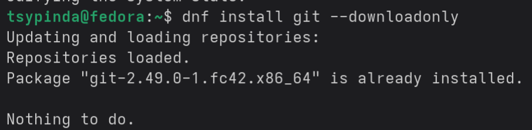{#fig-001 width=90%}

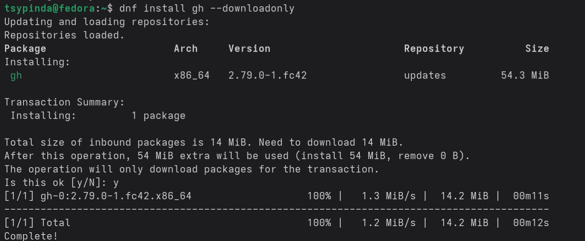{#fig-002 width=90%}

Проведем базовую настройку git.

Зададим имя и email владельца репозитория. Также настроим utf-8 в выводе сообщений git, настроим верификацию и подписание коммитов git. Зададим имя начальной ветки (master). Установим параметр autocrlf и safecrlf, гарантирующие, что у нас в главной ветке файлы только одного типа LF, а также не дает их преобразовывать. Настройка предупреждений с помощью core.safecrlf warn.

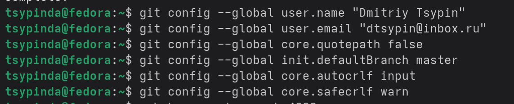{#fig-003 width=90%}

Создаем SSH ключ, копируем его.

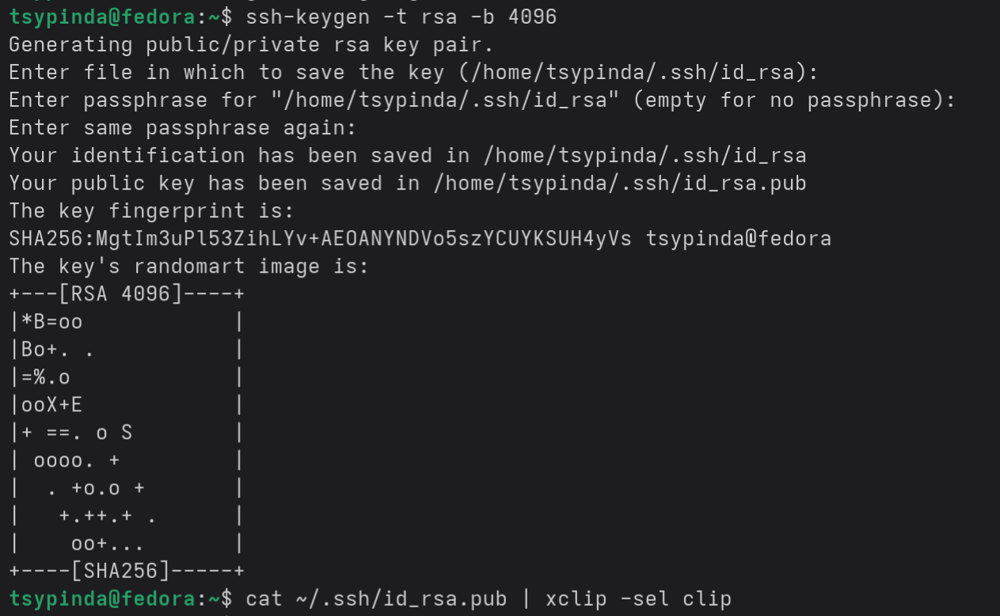{#fig-004 width=90%}

Добавляем SSH-ключ в git.

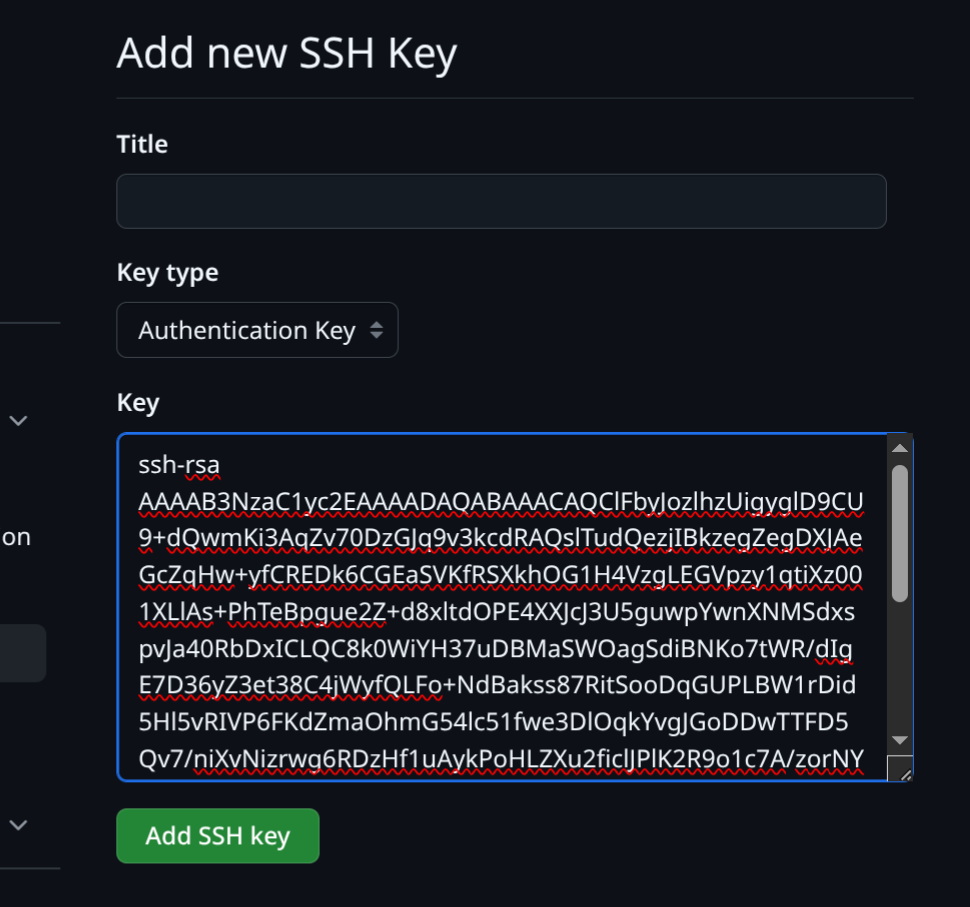{#fig-005 width=90%}

Создаем pgp ключ, соответствующий следующим параметрам:

тип RSA and RSA;  
размер 4096;  
0;  
Dmitriy:  
dtsypin@inbox.ru;  

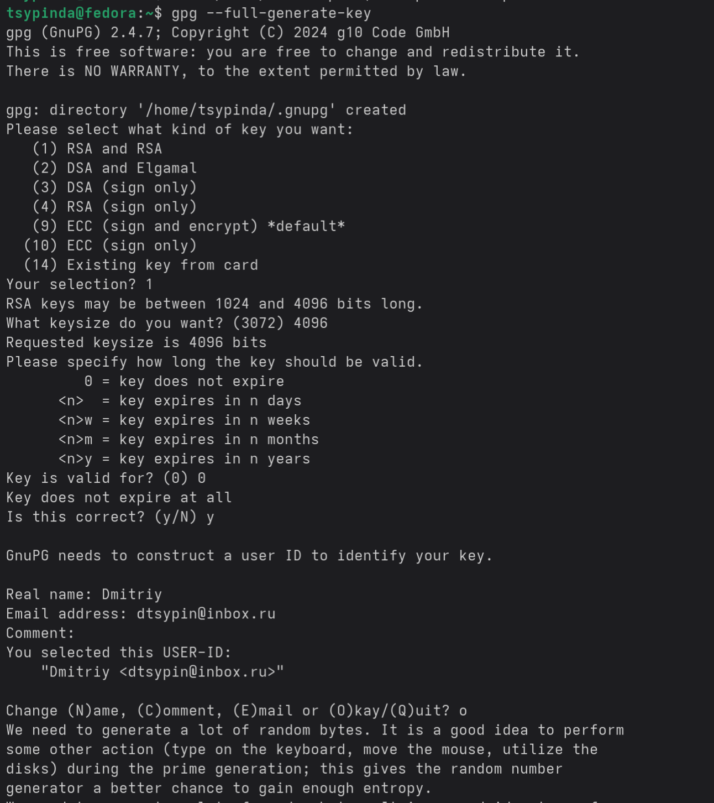{#fig-006 width=90%}

Выводим список ключей и копируем отпечаток приватного ключа.  
Отпечатком будет являться последовательность символов после первой / до пробела в строке sec.

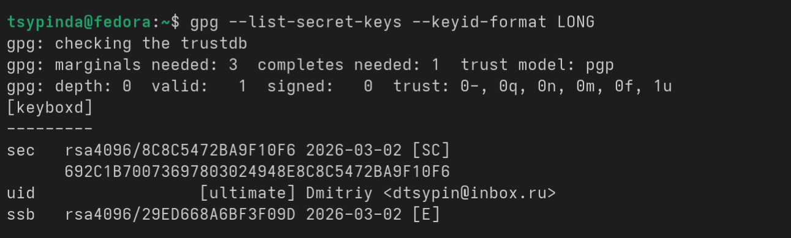{#fig-007 width=90%}

Копируем PGP ключ в буфер обмена и добавляем его на наш GitHub.

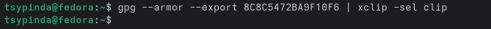{#fig-008 width=90%}

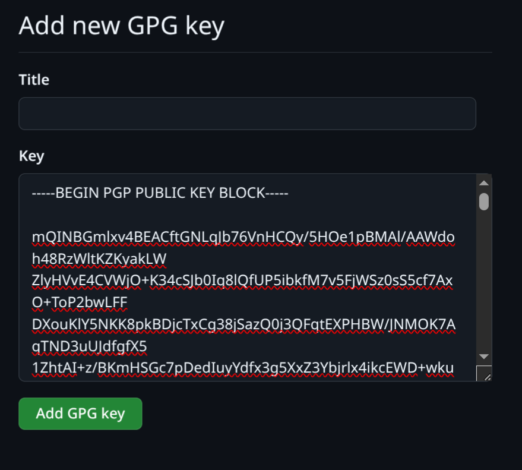{#fig-009 width=90%}

Настраиваем автоматическую подпись коммитов git, используя созданный ранее отпечаток PGP ключа.

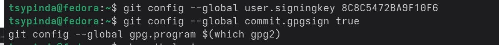{#fig-010 width=90%}

Настроим gh. Для начала нужно авторизоваться.  
Почему-то первоначальная настройка ПО не установила полностью gh, так что на этом этапе пришлось доустановить недостающие элементы (рис.11). Проходим авторизацию в браузере.

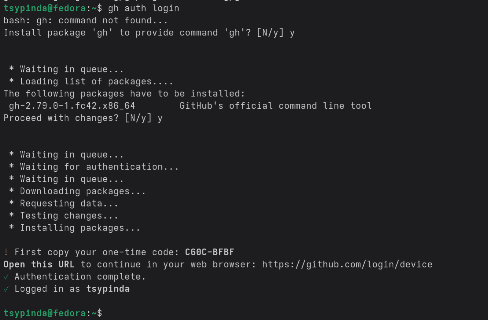{#fig-011 width=90%}

Создадим репозиторий для курса с помощью mkdir и перейдем туда с помозью cd.

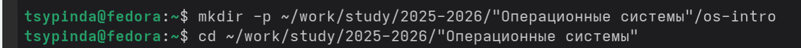{#fig-012 width=90%}

Создадим репозиторий на GitHub с помощью gh.

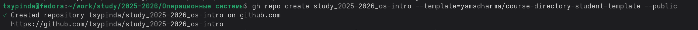{#fig-013 width=90%}

Клонируем репозиторий на компьютер в текущую папку для создания в дальнейшем здесь папок под лабораторные работы и в последствии выгрузки этого на GitHub.

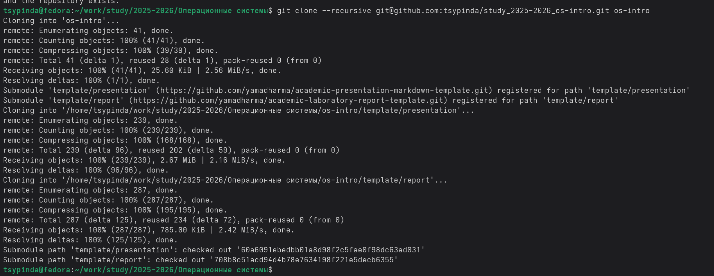{#fig-014 width=90%}

Переходим в сколнированную папку os-intro с помощью cd, удаляем там файл package.json, записываем в файл COURSE "os-intro" и с помощью make prepare создаем папки для выполнения лабораторных работ (рис.15).

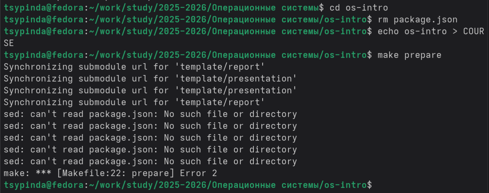{#fig-015 width=90%}

Отправляем файлы на сервер

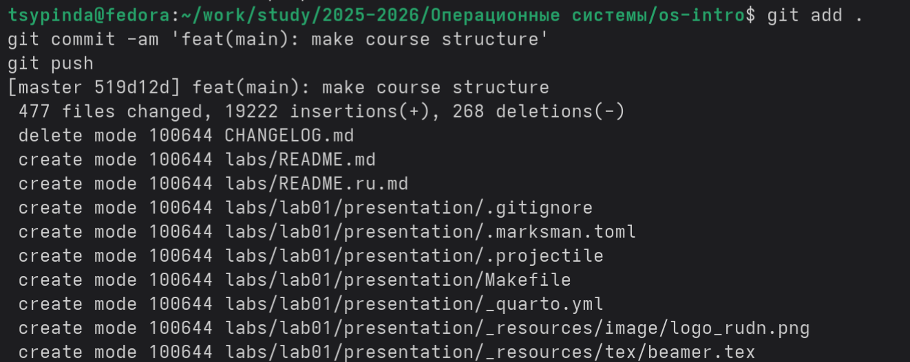{#fig-016 width=90%}

# Выводы

Я изучил идеологию и применение средств контроля версий и освоил умения по работе с git.

# Список литературы{.unnumbered}

::: {#refs}
:::
