---
## Author
author:
  name: Цыпин Дмитрий Алексеевич
  degrees: DSc
  orcid: 0000-0002-0877-7063
  email: 1032253633@pfur.ru
  affiliation:
    - name: Российский университет дружбы народов
      country: Российская Федерация
      postal-code: 117198
      city: Москва
      address: ул. Миклухо-Маклая, д. 7
## Title
title: "Лабораторная работа №5"
subtitle: "Настройка рабочей среды"
license: CC BY
date: today
date-format: "2026-03-03" # Example: 2025-09-06
---

# Информация

## Докладчик

:::::::::::::: {.columns align=center}
::: {.column width="70%"}

  * Цыпин Дмитрий Алексеевич
  * студент группы НПИбд-02-25
  * ст. билет - 1032253633
  * Российский университет дружбы народов им. П. Лумумбы
  * [1032253633@rudn.ru](mailto:1032253633@rudn.ru)

:::
::: {.column width="30%"}

:::
::::::::::::::

# Вводная часть

## Цели и задачи

- Настроить рабочую среду git

# Создание презентации

# Выполнение лабораторной работы

## С помощью sudo dnf install установим необходимое ПО

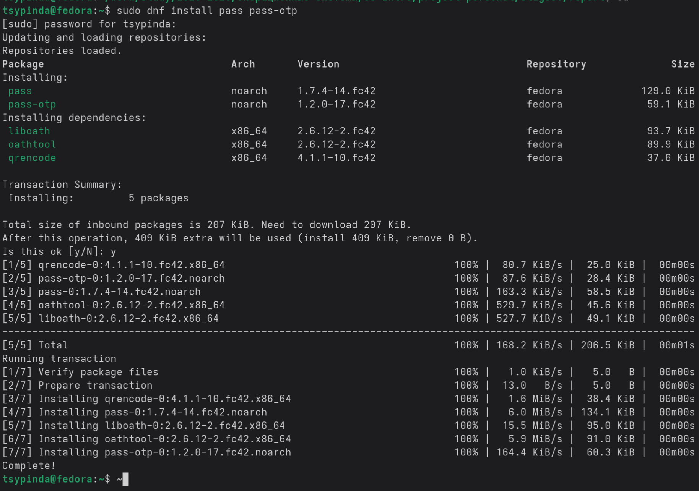{#fig-001 width=90%}

## Привяжем наш гитхаб через pgp ключ. Инициализируем хранилище.

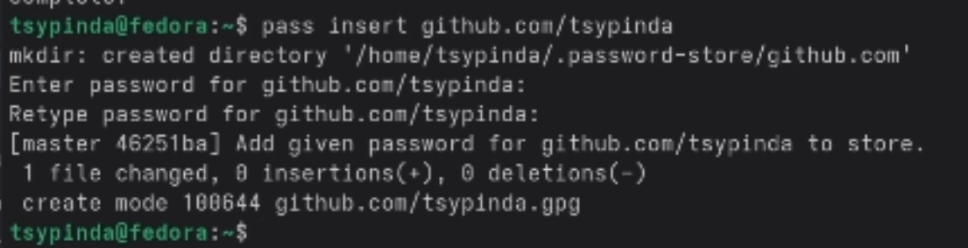{#fig-002 width=90%}

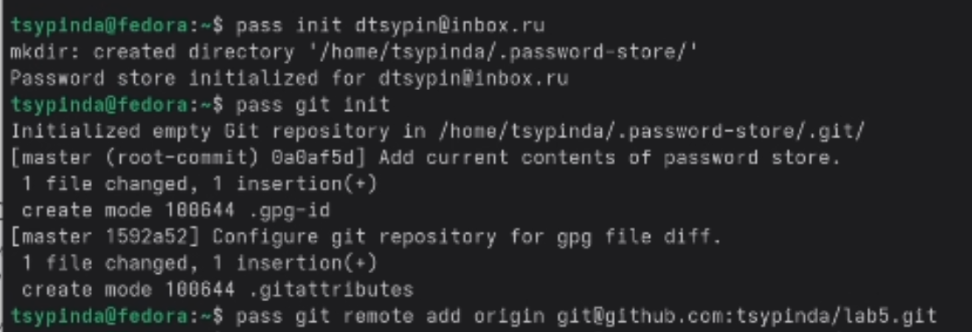{#fig-003 width=90%}

## Настроим интерфейс с броузером. Для этого установим плагин, обеспечивающий интерфейс native messaging.

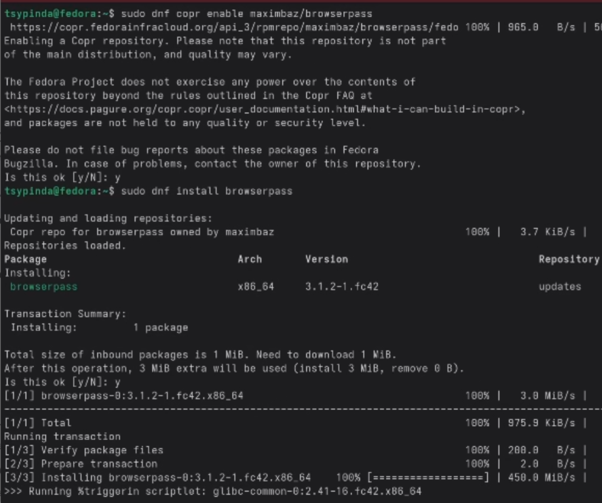{#fig-004 width=90%}

## Задаем пароль для гитхаба. Отображаем список паролей.

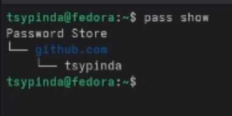{#fig-005 width=90%}

## Установим дополнительное ПО

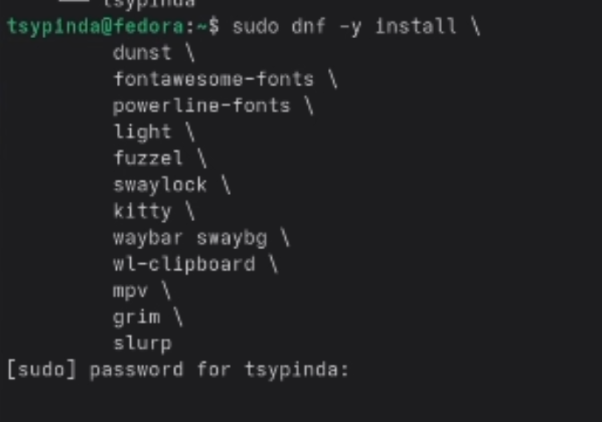{#fig-006 width=90%}

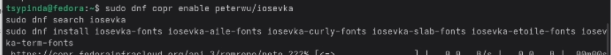{#fig-007 width=90%}

## 

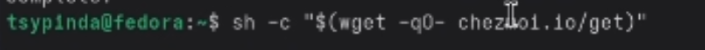{#fig-008 width=90%}

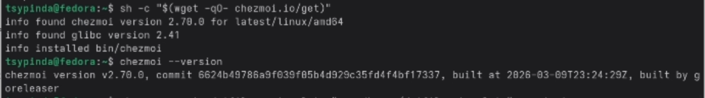{#fig-009 width=90%}

## Создадим свой репозиторий для конфигурационных файлов на основе шаблона. Для этого скопируем уже существующий с помощью gh.

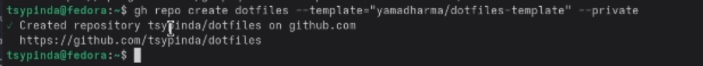{#fig-010 width=90%}

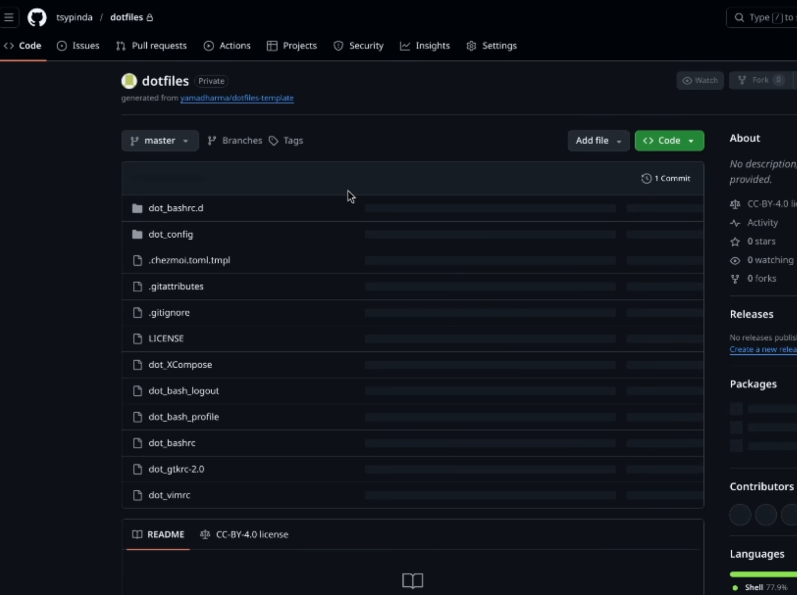{#fig-011 width=90%}

## Подключим репозиторий к своей системе

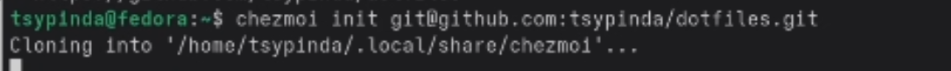{#fig-012 width=90%}

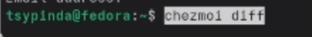{#fig-013 width=90%}

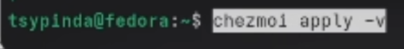{#fig-014 width=90%}

## Аналогично делаем на второй машине

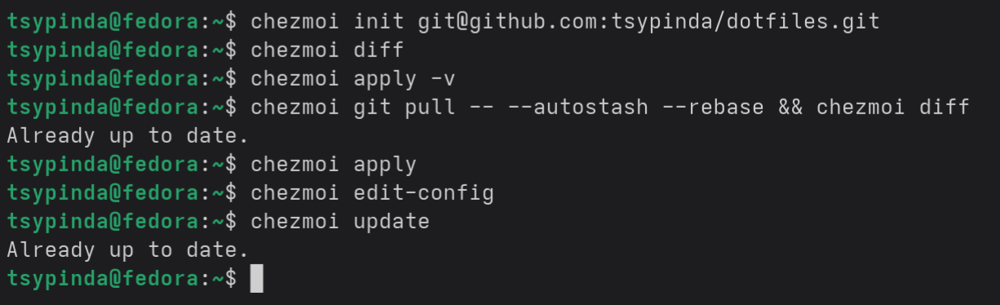{#fig-015 width=90%}

# Заключение

## Выводы

Я Настроил рабочую среду git.
