---
## Author
author:
  name: Цыпин Дмитрий Алексеевич
  degrees: DSc
  orcid: 0000-0002-0877-7063
  email: 1032253633@pfur.ru
  affiliation:
    - name: Российский университет дружбы народов
      country: Российская Федерация
      postal-code: 117198
      city: Москва
      address: ул. Миклухо-Маклая, д. 7
## Title
title: "Лабораторная работа №7"
subtitle: "Анализ файловой системы Linux. Команды для работы с файлами и каталогами"
license: CC BY
date: today
date-format: "2026-03-28" # Example: 2025-09-06
---

# Информация

## Докладчик

:::::::::::::: {.columns align=center}
::: {.column width="70%"}

  * Цыпин Дмитрий Алексеевич
  * студент группы НПИбд-02-25
  * ст. билет - 1032253633
  * Российский университет дружбы народов им. П. Лумумбы
  * [1032253633@rudn.ru](mailto:1032253633@rudn.ru)

:::
::: {.column width="30%"}

:::
::::::::::::::

# Вводная часть

## Цели и задачи

Ознакомление с файловой системой Linux, её структурой, именами и содержанием
каталогов. Приобретение практических навыков по применению команд для работы
с файлами и каталогами, по управлению процессами (и работами), по проверке исполь-
зования диска и обслуживанию файловой системы.

## Задания

1. Выполните все примеры, приведённые в первой части описания лабораторной работы.
2. Выполните следующие действия, зафиксировав в отчёте по лабораторной работе
используемые при этом команды и результаты их выполнения:
2.1. Скопируйте файл /usr/include/sys/io.h в домашний каталог и назовите его
equipment. Если файла io.h нет, то используйте любой другой файл в каталоге
/usr/include/sys/ вместо него.
2.2. В домашнем каталоге создайте директорию ~/ski.plases.
2.3. Переместите файл equipment в каталог ~/ski.plases.
2.4. Переименуйте файл ~/ski.plases/equipment в ~/ski.plases/equiplist.
2.5. Создайте в домашнем каталоге файл abc1 и скопируйте его в каталог
~/ski.plases, назовите его equiplist2.
2.6. Создайте каталог с именем equipment в каталоге ~/ski.plases.
2.7. Переместите файлы ~/ski.plases/equiplist и equiplist2 в каталог
~/ski.plases/equipment.
2.8. Создайте и переместите каталог ~/newdir в каталог ~/ski.plases и назовите
его plans.

## Задания

3. Определите опции команды chmod, необходимые для того, чтобы присвоить перечис-
ленным ниже файлам выделенные права доступа, считая, что в начале таких прав
нет:
3.1. drwxr--r-- ... australia
3.2. drwx--x--x ... play
3.3. -r-xr--r-- ... my_os
3.4. -rw-rw-r-- ... feathers
При необходимости создайте нужные файлы.
4. Проделайте приведённые ниже упражнения, записывая в отчёт по лабораторной
работе используемые при этом команды:
4.1. Просмотрите содержимое файла /etc/password.
4.2. Скопируйте файл ~/feathers в файл ~/file.old.
4.3. Переместите файл ~/file.old в каталог ~/play.
4.4. Скопируйте каталог ~/play в каталог ~/fun.
4.5. Переместите каталог ~/fun в каталог ~/play и назовите его games.
4.6. Лишите владельца файла ~/feathers права на чтение.
4.7. Что произойдёт, если вы попытаетесь просмотреть файл ~/feathers командой
cat?
4.8. Что произойдёт, если вы попытаетесь скопировать файл ~/feathers?
4.9. Дайте владельцу файла ~/feathers право на чтение.
4.10. Лишите владельца каталога ~/play права на выполнение.
4.11. Перейдите в каталог ~/play. Что произошло?
4.12. Дайте владельцу каталога ~/play право на выполнение.
5. Прочитайте man по командам mount, fsck, mkfs, kill и кратко их охарактеризуйте,
приведя примеры

# Выполнение лабораторной работы

## Выполнение примеров

Создаем файл abc1 (touch abc1), создаем копию файла и называем ее april (cp abc1 april), аналогично создаем файл may (рис.1)

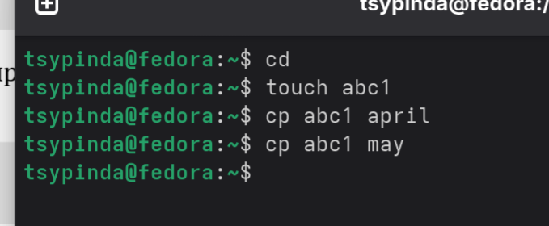{#fig-001 width=90%}

## 
Создаем каталог monthly (mkdir monthly) и копируем туда файлы april, may (рис.2)

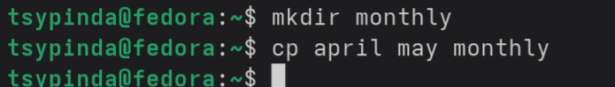{#fig-002 width=90%}

## 
Копируем may, копию называем june. Смотрим файлы с помощью ls (рис.3)

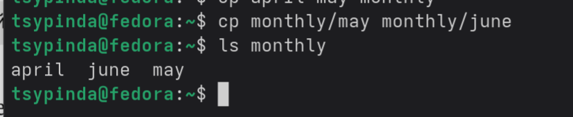{#fig-003 width=90%}

## 
Создаем новый каталог monthly.00, копируем monthly в monthly.00 (рис.4)

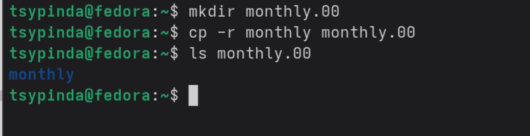{#fig-004 width=90%}

## 
Копируем monthly.00 в /tmp, проверяем (рис.5)

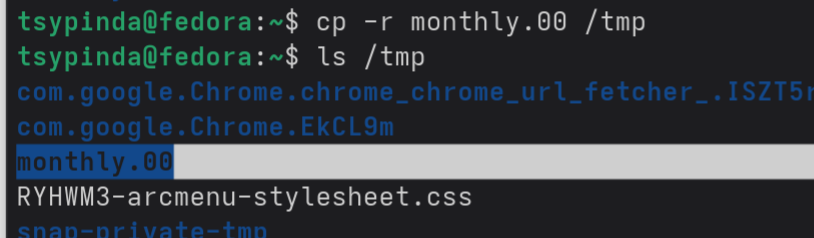{#fig-005 width=90%}

## 
Переименовываем april в july (mv april july). Переносим july в monthly.00 (mv july monthly.00), проверяем (рис.6)

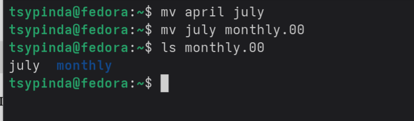{#fig-006 width=90%}

##
Создаем каталог reports, переименовываем monthly.00 в monthly.01 и перемещаем в reports (рис.7)

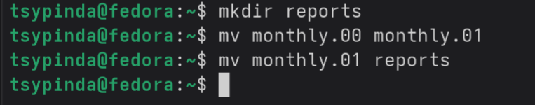{#fig-007 width=90%}

##
Создаем файл may и меняем его права. Сначала даем право на запуск владельцу файла, затем забираем (рис.8)

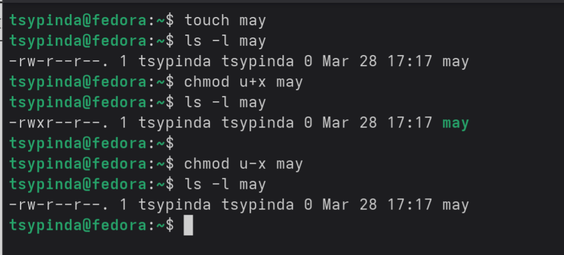{#fig-008 width=90%}

##
Создаем каталог, забираем права на чтение у всех кроме владельца (рис.9)

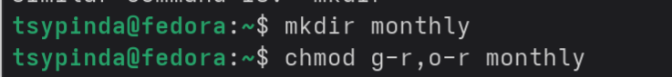{#fig-009 width=90%}

##
Создаем abc1, даем права на редактирование группе, в которой находится владелец файла (рис.10)

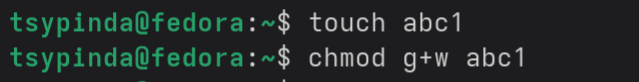{#fig-010 width=90%}

## Выполнение задания

С помощью cp копируем файл io.h и называем его equipment (рис.11)

Создаем директорию ski.plases в домашнем каталоге с помощью mkdir (рис.11)

Перещаем файл equipment в ski.plases (рис.11)

Переименовывем файл equipment в equiplist (рис. 11)

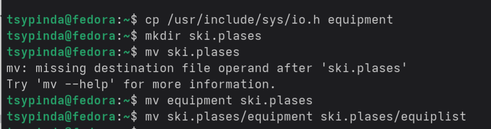{#fig-011 width=90%}

##
Создаем файл abc1 и копируем его в каталог ski.plases/ с названием equiplist2 (рис.12)

Создаем каталог equipment в ski.plases (рис.12)

Перемещаем файлы equiplist и equiplist2 в equipment (рис.12)

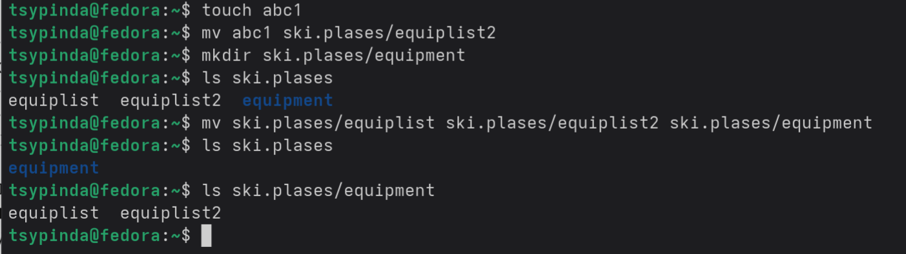{#fig-012 width=90%}

##
Создаем каталог newdir, перемещаем его в ski.plases и переименовываем в plans (рис.13)

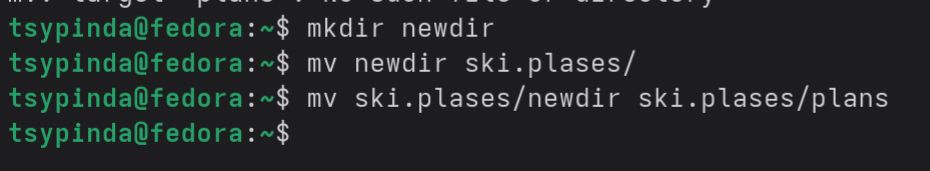{#fig-013 width=90%}

## Выполнение задания

Для первых двух случаев создаем каталоги (указывает d в начале, mkdir), для последних двух - файлы (touch).  
Для каждого файла устанавливаем соответствующие права. Первые 3 (после d или первой -) -- права на r (чтение), w (запись), x (запуск) для владельца файла (u), затем для группы, в которой есть владелец (g), уже после для остальных пользователей (o). В соответствии с этим либо добавляем (+), либо убавляем (-) права для каждого файла. Просматрвиаем с помощью ls -ld НАЗВАНИЕ_ФАЙЛА (рис.14)

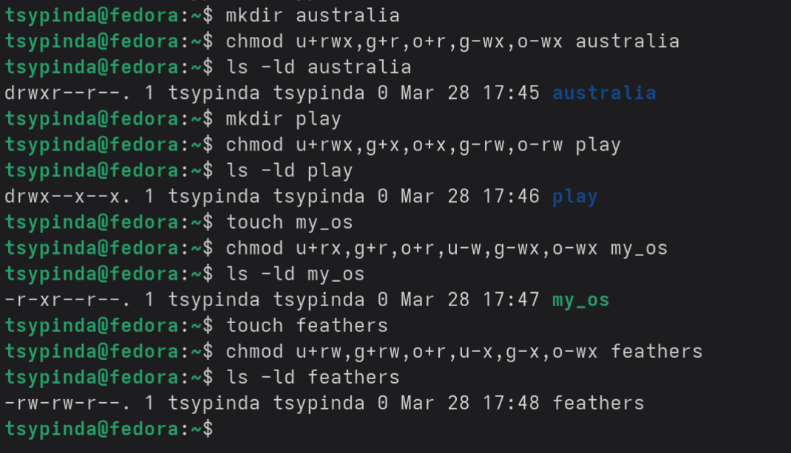{#fig-014 width=90%}

## Выполнение задания

Просматриваем /etc/passwrd с помощью cat (рис.15)

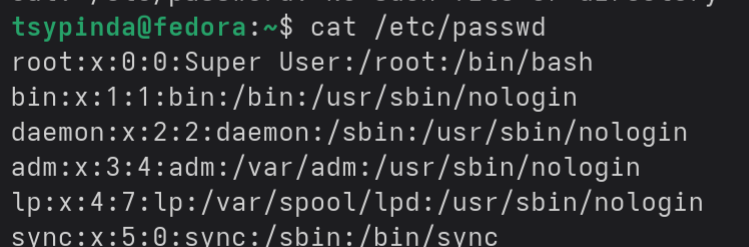{#fig-015 width=90%}

##
Копируем файл feathers и называем копию file.old (рис.16)

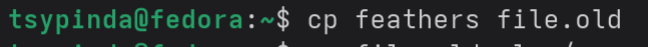{#fig-016 width=90%}

##
Копируем каталог play в каталог fun (рис.17)

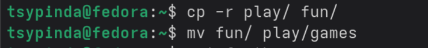{#fig-017 width=90%}

##
Забираем права на чтение у файла feathers и пытаемся его просмотреть с помощью cat. Ничего не выходит. Пытаемся скопировать - аналогично, "Недостаточно прав" (рис.18)

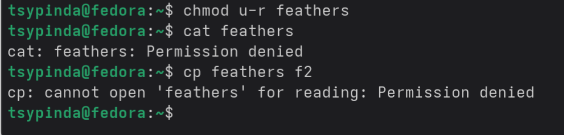{#fig-018 width=90%}

##
Возвращаем права feathers. Аналогичное проворачиваем с каталогом play, пытаемся скопировать - "Недостаточно прав". Возвращаем права (рис.19)

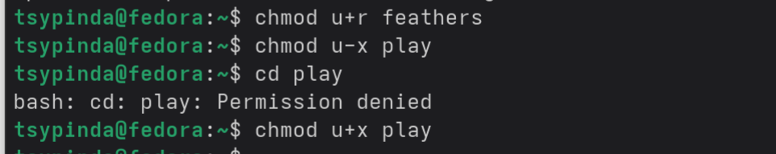{#fig-019 width=90%}

## Выполнение задания

Поочередно вводим команды с man. Каждая такая команда открывает подробное описание работы команд (рис.20)

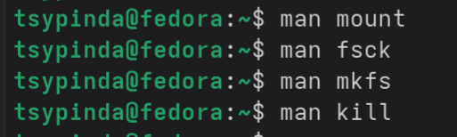{#fig-020 width=90%}

##
Значения:

mount - работает с файловым деревом

fsck - утилита для починки системных файлов

mkfs - утилита для создания системных файлов ОС, помогает сбросить настройки к заводским

kill - останавливает конкретный процесс

# Заключение

## Выводы

Я ознакомился с файловой системой Linux, её структурой, именами и содержанием
каталогов, приобрел практические навыки по применению команд для работы
с файлами и каталогами, по управлению процессами (и работами), по проверке использования диска и обслуживанию файловой системы.
