---
## Author
author:
  name: Цыпин Дмитрий Алексеевич
  degrees: DSc
  orcid: 0000-0002-0877-7063
  email: 1032253633@pfur.ru
  affiliation:
    - name: Российский университет дружбы народов
      country: Российская Федерация
      postal-code: 117198
      city: Москва
      address: ул. Миклухо-Маклая, д. 7

## Title
title: "Лабораторная работа №8"
subtitle: "Поиск файлов. Перенаправление ввода-вывода. Просмотр запущенных процессов"
license: "CC BY"
---

# Цель работы

Ознакомление с инструментами поиска файлов и фильтрации текстовых данных.
Приобретение практических навыков: по управлению процессами (и заданиями), по
проверке использования диска и обслуживанию файловых систем.

# Задание

1. Осуществите вход в систему, используя соответствующее имя пользователя.
2. Запишите в файл file.txt названия файлов, содержащихся в каталоге /etc. Допи-
шите в этот же файл названия файлов, содержащихся в вашем домашнем каталоге.
3. Выведите имена всех файлов из file.txt, имеющих расширение .conf, после чего
запишите их в новый текстовой файл conf.txt.
4. Определите, какие файлы в вашем домашнем каталоге имеют имена, начинавшиеся
с символа c? Предложите несколько вариантов, как это сделать.
5. Выведите на экран (по странично) имена файлов из каталога /etc, начинающиеся
с символа h.
6. Запустите в фоновом режиме процесс, который будет записывать в файл ~/logfile
файлы, имена которых начинаются с log.
7. Удалите файл ~/logfile.
8. Запустите из консоли в фоновом режиме редактор gedit.
9. Определите идентификатор процесса gedit, используя команду ps, конвейер и фильтр
grep. Как ещё можно определить идентификатор процесса?
10. Прочтите справку (man) команды kill, после чего используйте её для завершения
процесса gedit.
11. Выполните команды df и du, предварительно получив более подробную информацию
об этих командах, с помощью команды man.
12. Воспользовавшись справкой команды find, выведите имена всех директорий, имею-
щихся в вашем домашнем каталоге.

# Выполнение лабораторной работы

## 

Т.к. я выполняю лабораторную работу на своем ПК и уже вошел в систему Линукс под своим именем, мне остается лишь открыть Терминал - я уже буду авторизован под нужным именем.

##

С помощью touch создадим необходимый файл, с помощью ls и > запишем в него вывод ls. Затем аналогичным образом, используя >> вместо >, добавим вывод ls в домашнем каталоге (рис.1) 

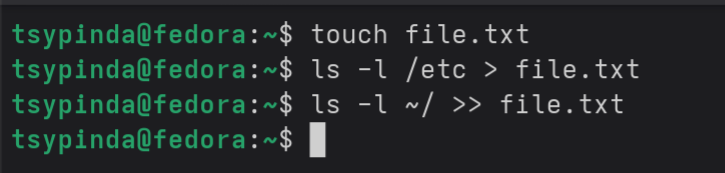{#fig-001 width=90%}

##

Воспользуемся grep для того, чтобы вывести все имена файлов из file.txtю Используем синтаксис grep _Фраза, которая должна содержаться в нашем файле. У нас .conf_ *Имя файла, в нашем случае file.txt* (рис.2)

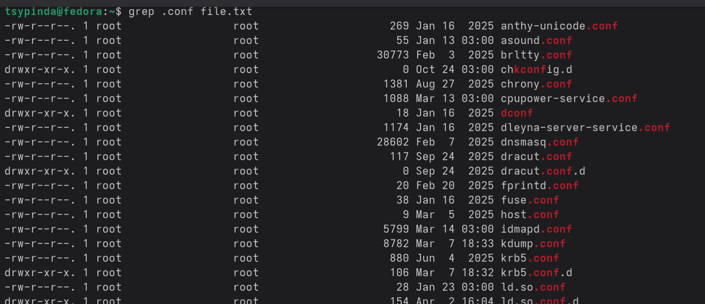{#fig-002 width=90%}

Создадим новый файл с помощью touch и запишем в него вывод, добавив к прошлой команде > conf.txt (рис.3)

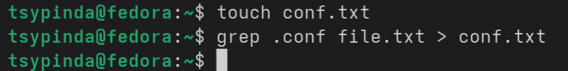{#fig-003 width=90%}

##

Для того, чтобы определить, какие файлы в домашнем каталоге имеют имена, начинающиеся с с, воспользуемся командой find. Укажем -maxdepth 1 для того, чтобы find не искал в каталогах такие файлы, а оставася в домашнем, затем укажем "c*", чтобы работать только с начинающимеся на с, и -print, чтобы вывести в консоль (рис.4)

Второй способ - через ls. Пишем ls ~ для вывода всех файлов, добавляем условие grep "^c" - начинается с с (рис.4)

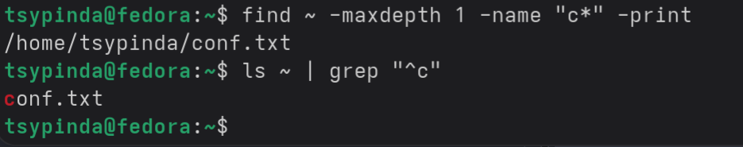{#fig-004 width=90%}

##

Аналогично предыдущему, выводим все файлы, начинающиеся с h (рис.5)

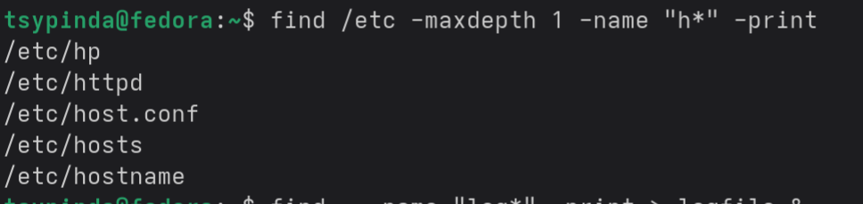{#fig-005 width=90%}

##

С помощью find запускаем процесс, который будет записывать в файл ~/logfile файлы, начинающиеся с log (рис.6)

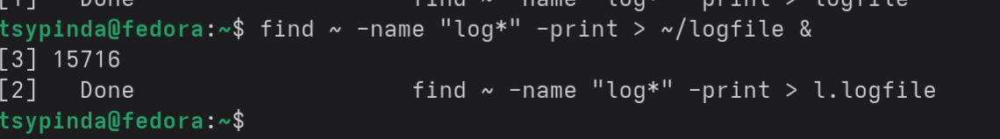{#fig-006 width=90%}

##

Удаляем файл с помощью rm (рис.7)

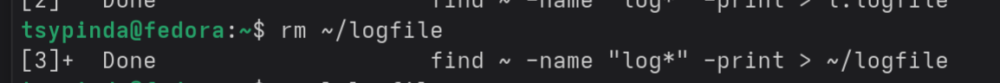{#fig-007 width=90%}

##

Для запуска gedit в фоновом режиме, используем & (рис.8)

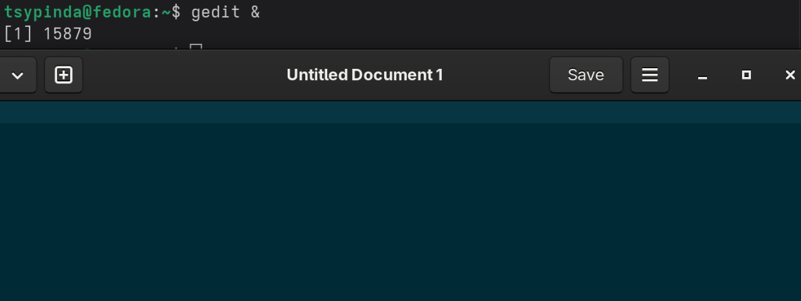{#fig-008 width=90%}

##

С помощью ps, конвейера и фильтра grep определяем индификатор процесса gedit. Используем метод pgrep gedit - выполняет аналогичную функцию (рис.9)

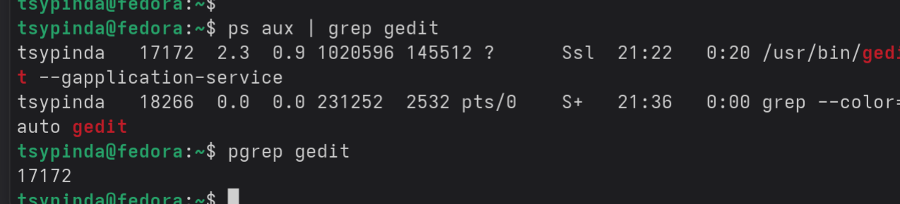{#fig-009 width=90%}

##

Удаляем процесс с помощью kill (рис.10)

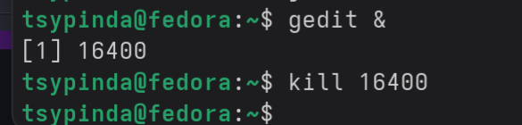{#fig-010 width=90%}

##

С помощью man df просматриваем справку о df. Затем выполняем df -h (используем -h для удобного чтения "human-reading") (рис.11)

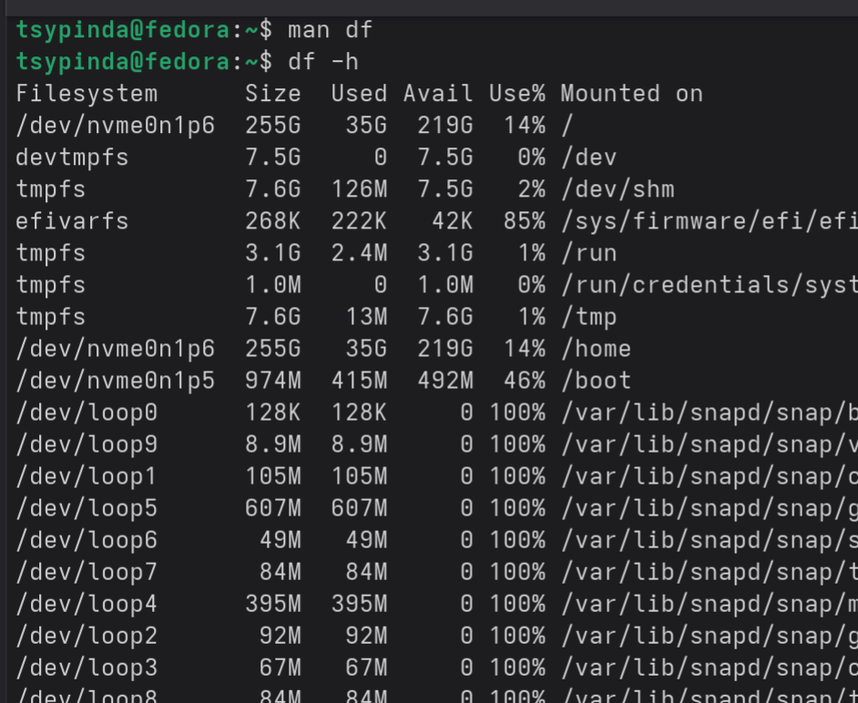{#fig-011 width=90%}

Аналогично с помощью man смотрим справку о du. Используем фильтры -sh (s - сумма веса всех файлов, используем для краткости вывода, h - аналогично df) (рис.12)

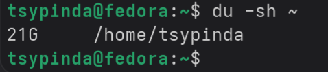{#fig-012 width=90%}

##

С помощью man find вызываем справку по find, ознакамливаемся, затем используем фильтр -d, чтобы просматривать только директории, maxdepth 1 - чтобы просматривать исключительно в выбранном (домашнем) каталоге (рис.13)

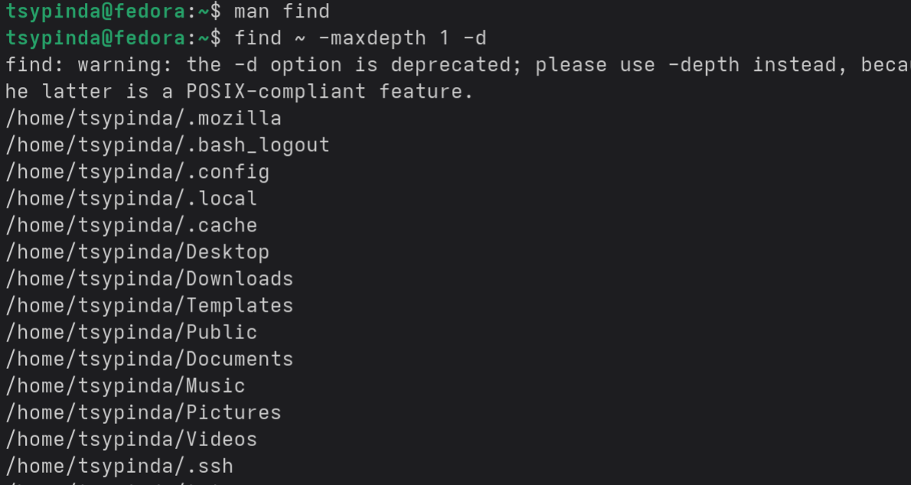{#fig-013 width=90%}

## Выполнение примеров

Я ознакомился с инструментами поиска файлов и фильтрации текстовых данных.
Приобрел практические навыки: по управлению процессами (и заданиями), по
проверке использования диска и обслуживанию файловых систем.

# Выводы

# Список литературы{.unnumbered}

::: {#refs}
:::
