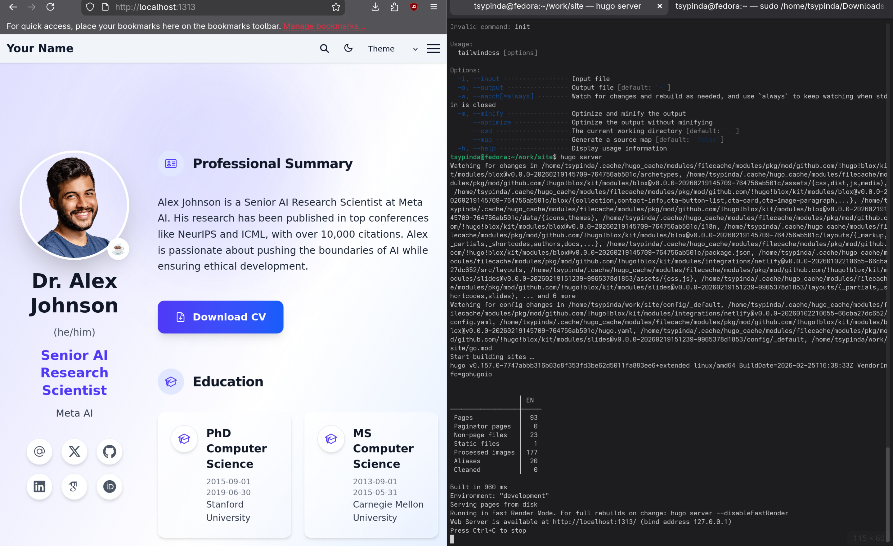

---
## Author
author:
  name: Цыпин Дмитрий Алексеевич, НПИбд-02-25, 1032253633
  degrees: DSc
  orcid: 0000-0002-0877-7063
  email: 1032253633@pfur.ru
  affiliation:
    - name: Российский университет дружбы народов
      country: Российская Федерация
      postal-code: 117198
      city: Москва
      address: ул. Миклухо-Маклая, д. 7
## Title
title: "Первый этап реализации проекта"
subtitle: "Размещение на Github Pages заготовки персонального сайта"
license: "CC BY"
date: today
date-format: "2026-03-07" # Example: 2025-09-06
---

# Информация

## Докладчик

:::::::::::::: {.columns align=center}
::: {.column width="70%"}

  * Цыпин Дмитрий Алексеевич
  * студент группы НПИбд-02-25
  * ст. билет - 1032253633
  * Российский университет дружбы народов им. П. Лумумбы
  * [1032253633@rudn.ru](mailto:1032253633@rudn.ru)

:::
::: {.column width="30%"}

:::
::::::::::::::

# Вводная часть

## Актуальность

- Персональный сайт научного работника важен, т.к. именно благодаря ему можно узнать всю важную информацию о работнике, а также найти актуальную информацию по его работам.

## Объект и предмет исследования

- GitHub Pages
- GitHub
- Hugo

## Цели и задачи

- Разместить заготовку персонального сайта на Github Pages

## Материалы и методы

- GitHub
- GitHub Pages
- Hugo
- Репозиторий шаблона сайта

## Задание

1. Установить необходимое программное обеспечение.
2. Скачать шаблон темы сайта.
3. Разместить его на хостинге git.
4. Установить параметр для URLs сайта.
5. Разместить заготовку сайта на Github pages.

## Техническая реализация проекта

- Для реализации сайта используется генератор статических сайтов Hugo.
- Общие файлы для тем Wowchemy:
-- Репозиторий: https://github.com/wowchemy/wowchemy-hugo-themes
- В качестве шаблона индивидуального сайта используется шаблон Hugo Academic Theme.
-- Демо-сайт: https://academic-demo.netlify.app/
-- Репозиторий: https://github.com/wowchemy/starter-hugo-academic

# Выполнение первого этапа

## Установка программного обеспечения

- Устанавливаем git и go с помощью sudo dnf install
- Устанавливаем hugo "руками"

## Скачивание шаблона темы сайта

- Клонируем репозиторий в подготовленную заранее папку
- Запускаем сервер локально
- Устраняем ошибки с недоскачанной библиотекой npm и модулем tailwindcss
- Повторно запускаем сервер локально 

## Размещение на хостинге гит

- Создаем новый репозиторий на GitHub для будущего сайта
- Отвязываем папку site от гитхаба создателя шаблона
- Привязываем к новому репозиторию

## Установка параметра URLs

- В файле hugo.yaml меняем URL на наш

## Размещение заготовки на GitPages

- Настраиваем GitPages
- Успешно размещаем сайт

# Результаты

## Вывод

- Я смог разместить шаблон своего будушего персонального сайта на GitPages.
