---
## Author
author:
  name: Цыпин Дмитрий Алексеевич, НПИбд-02-25, 1032253633
  degrees: DSc
  orcid: 0000-0002-0877-7063
  email: 1032253633@pfur.ru
  affiliation:
    - name: Российский университет дружбы народов
      country: Российская Федерация
      postal-code: 117198
      city: Москва
      address: ул. Миклухо-Маклая, д. 7

## Title
title: "Первый этап реализации проекта"
subtitle: "Размещение на Github Pages заготовки персонального сайта"
license: "CC BY"
---

# Цель работы

Разместить заготовку персонального сайта на Github Pages

# Задание

1. Установить необходимое программное обеспечение.
2. Скачать шаблон темы сайта.
3. Разместить его на хостинге git.
4. Установить параметр для URLs сайта.
5. Разместить заготовку сайта на Github pages.

# Теоретическое введение

## Техническая реализация проекта

- Для реализации сайта используется генератор статических сайтов Hugo.
- Общие файлы для тем Wowchemy:
-- Репозиторий: https://github.com/wowchemy/wowchemy-hugo-themes
- В качестве шаблона индивидуального сайта используется шаблон Hugo Academic Theme.
-- Демо-сайт: https://academic-demo.netlify.app/
-- Репозиторий: https://github.com/wowchemy/starter-hugo-academic

# Выполнение этапа проектной работы

## 1. Установка программного обеспечения

Для работы нам потребуется следующее ПО: 

- git
- hugo
- go (модуль hugo)

Установим git и go через sudo dnf install в терминале (рис.1)

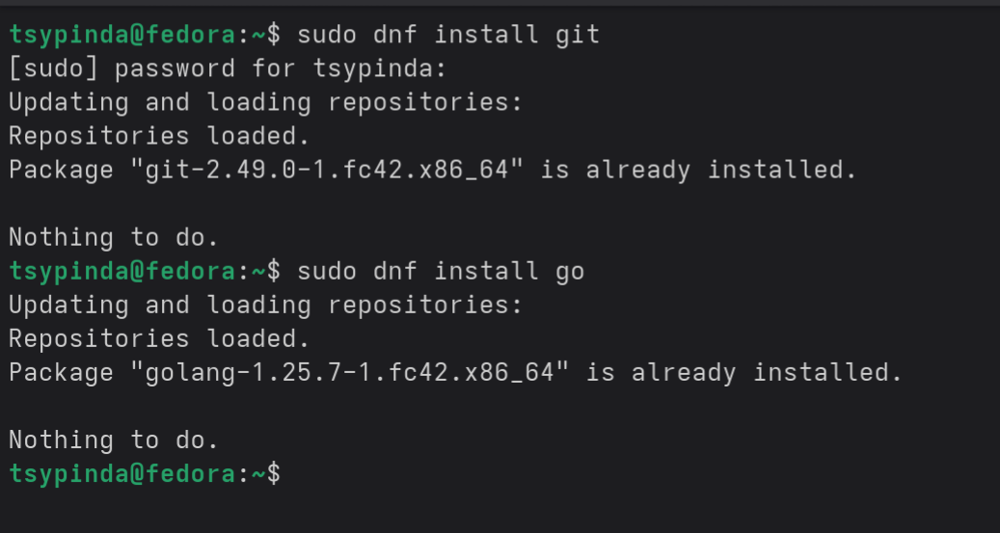{#fig-001 width=90%}

Установить hugo через sudo dnf install можно, однако sudo dnf устанавливает старую версию, которая не работает корректно для наших задач. Установим вручную. Для этого скачаем gz файл с официального Гитхаба hugo (рис.2)

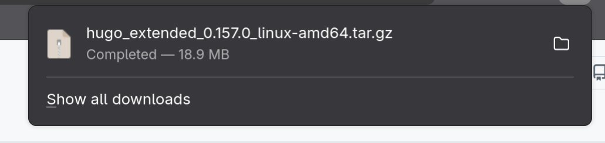{#fig-002 width=90%}

Затем откроем папку Downloads в терминале и разархивируем скачанный архив с помощью tar. Используем ключи -xzf для того, чтобы извлечь файлы из архива (x), а также дать имя файлу (f). Используем z для того, чтобы дать понять, что мы работаем с файлами .gz (рис.3).  
Перемещаем разархивированный файл в папку /usr/local/bin для того, чтобы поставить hugo (sudo mv hugo /usr/local/bin). Проверяем корректность установки с помощью команды hugo version (рис.3).

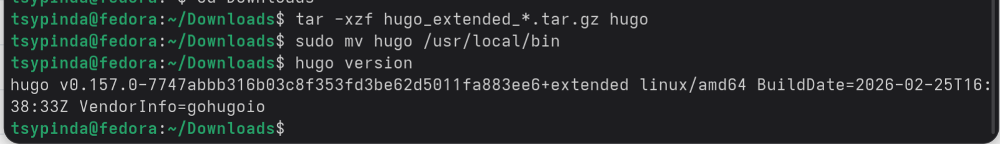{#fig-003 width=90%}

## 2. Скачивание шаблона темы сайта

Перейдем в папку, где будет хранится наш сайт, находящуюся по адресу ~/work. Скачаем сайт с Github в папку site с помощью git clone SSH_KEY site (рис.4)

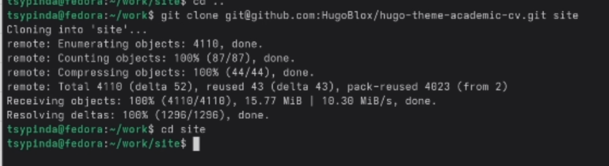{#fig-004 width=90%}

Для проверки работоспособности запустим наш сайт локально с помощью hugo server (рис.5).

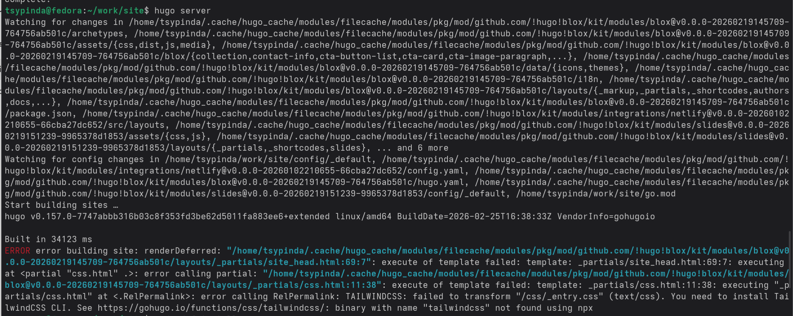{#fig-005 width=90%}

Как мы можем заметить на рисунке 5, у нас вылезает ошибка из-за того, что часть компонентов не была скачана. Доустановим библиотеку npm и необходимый для нас tailwindcss (рис.6). Используем sudo dnf install и npm install.

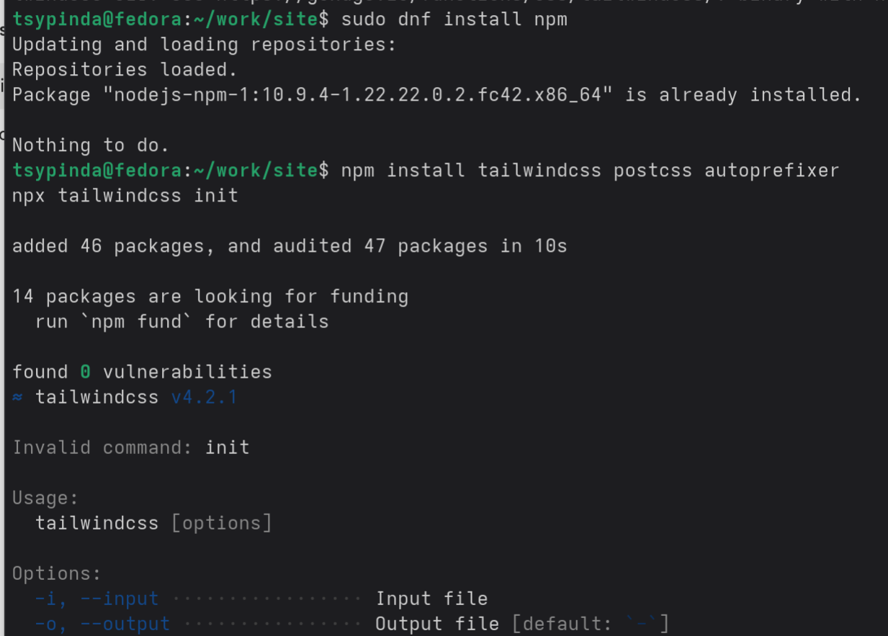{#fig-006 width=90%}

Повторно попробуем запусть сайт локально (рис.7).

{#fig-007 width=90%}

Сайт запустился корректно.

## 3. Размещение на хостинге гит

Создадим новый репозиторий для нашего будущего сайта (рис.8). В качестве имени используем будущий адрес сайта (tsypinda.github.io)

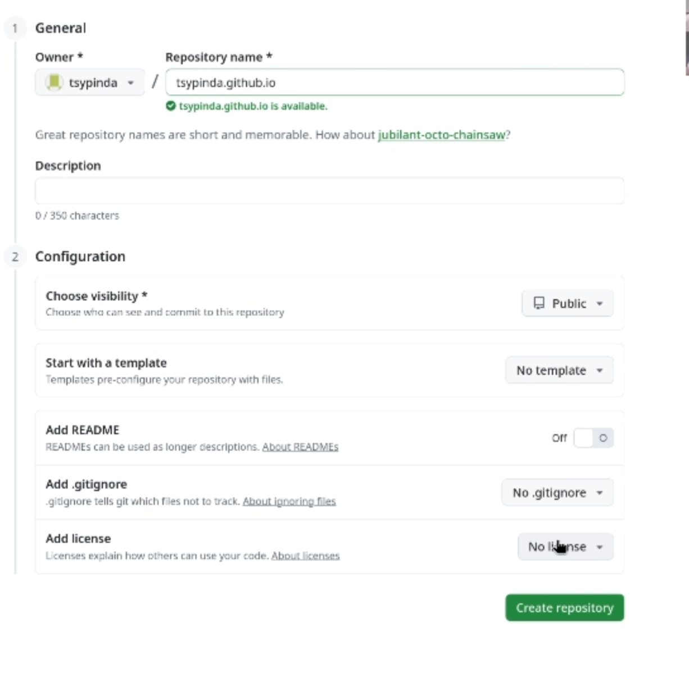{#fig-008 width=90%}

Отвяжем от гитхаба шаблона нашу папку site и привяжем к новому репозиторию. Привяжем к ветке main наш репозиторий, отправим origin и main на гитхаб (рис.9).  

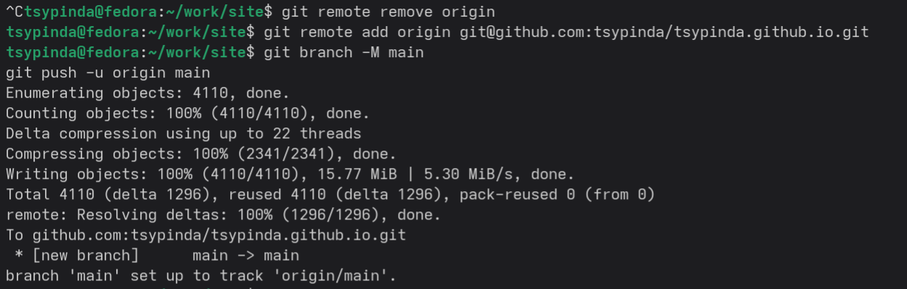{#fig-009 width=90%}

## 4. Установка параметра URLs

В файле ~/work/site/config/_default/hugo.yaml зададим URL для сайта. URL: https://tsypinda.github.io.git (рис.10)

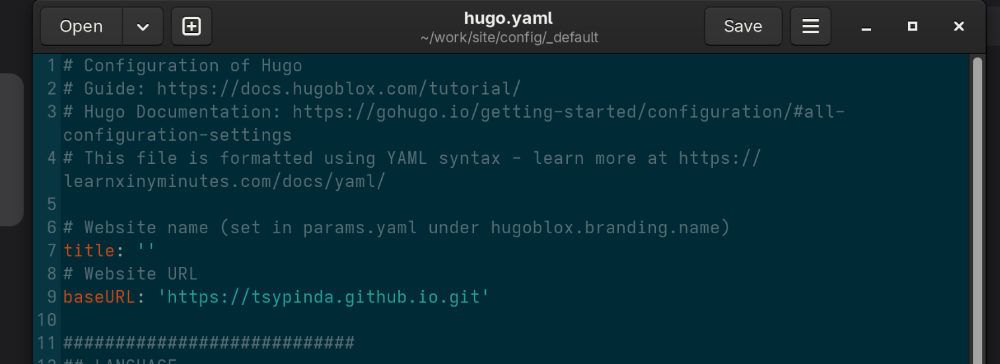{#fig-010 width=90%}

## 5. Размещение заготовки на GitPages

Переходим в Settings -> Pages на Github в нашем репозитории. Проверяем правильность установленной ветки в main и других настроек сайта (рис.11).

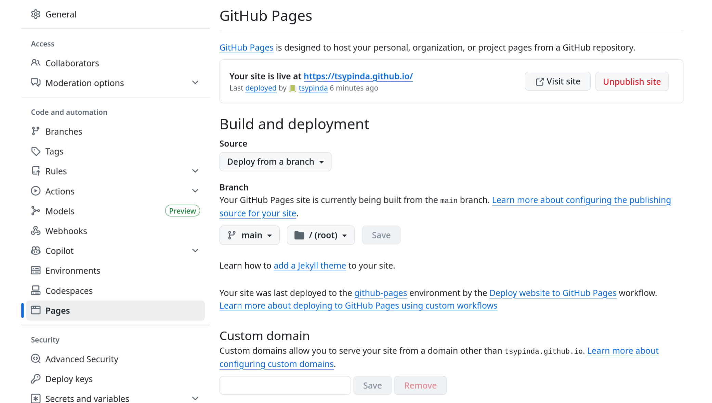{#fig-011 width=90%}

Отправим коммит на гитхаб, отправим все файлы (рис.12).

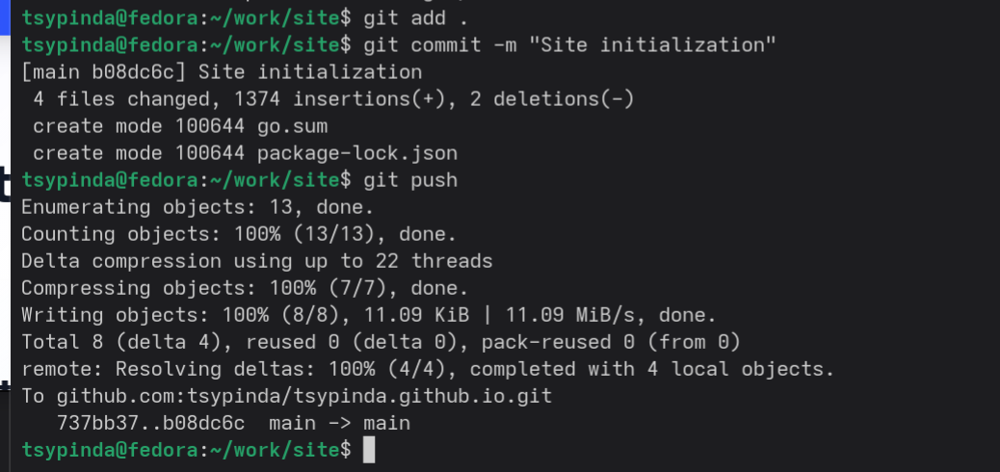{#fig-012 width=90%}

Проверяем работу сайта по ссылке https://tsypinda.github.io/ (рис.13)

{#fig-013 width=90%}

Сайт работает - значит первый этап выполнен.

# Выводы

Я смог разместить шаблон своего будушего персонального сайта на GitPages.
