---
## Author
author:
  name: Цыпин Дмитрий Алексеевич, НПИбд-02-25, 1032253633
  degrees: DSc
  orcid: 0000-0002-0877-7063
  email: 1032253633@pfur.ru
  affiliation:
    - name: Российский университет дружбы народов
      country: Российская Федерация
      postal-code: 117198
      city: Москва
      address: ул. Миклухо-Маклая, д. 7

## Title
title: "Второй этап реализации проекта"
subtitle: "Размещение персональной информации на сайт"
license: "CC BY"
---

# Цель работы

Разместить персональную информацию на сайте

# Задание

Добавить к сайту данные о себе.

Список добавляемых данных:
- Разместить фотографию владельца сайта.
- Разместить краткое описание владельца сайта (Biography).
- Добавить информацию об интересах (Interests).
- Добавить информацию от образовании (Education).
Сделать пост по прошедшей неделе.
Добавить пост на тему "Управление версиями. Git."

# Теоретическое введение

## Техническая реализация проекта

- Для реализации сайта используется генератор статических сайтов Hugo.
- Общие файлы для тем Wowchemy:
-- Репозиторий: https://github.com/wowchemy/wowchemy-hugo-themes
- В качестве шаблона индивидуального сайта используется шаблон Hugo Academic Theme.
-- Демо-сайт: https://academic-demo.netlify.app/
-- Репозиторий: https://github.com/wowchemy/starter-hugo-academic

# Выполнение этапа проектной работы

## Изменение персональных данных

Для начала изменим персональную информацию. Для этого нам потребуется изменить 3 файла: _index.md (находится в ~/work/site/content, в нем меняем название некоторых объектов сайта, а также заполняем интересы), params.yaml (~work/site/config/_default, меняется имя слева в углу, а также мелкие детали) и me.yaml (~work/site/data/authors, основная информация - имя, биография и всё, что мы видим первым делом, открывая сайт). (рис.1-рис.3)

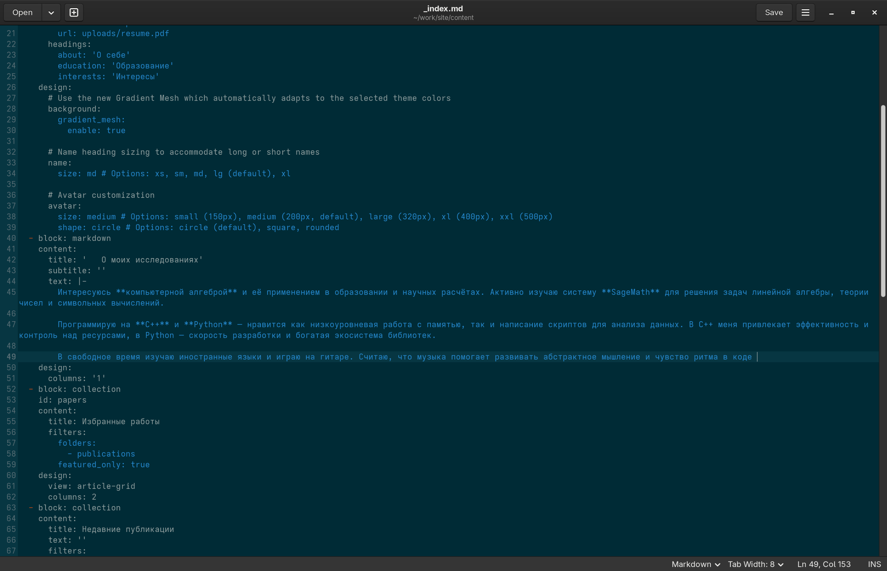{#fig-001 width=90%}

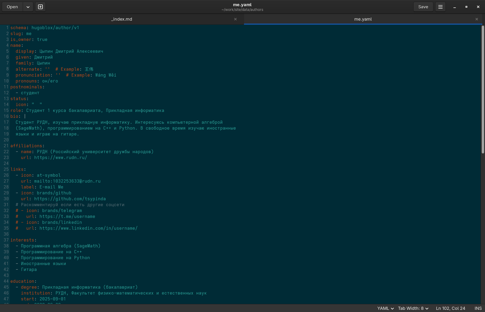{#fig-002 width=90%}

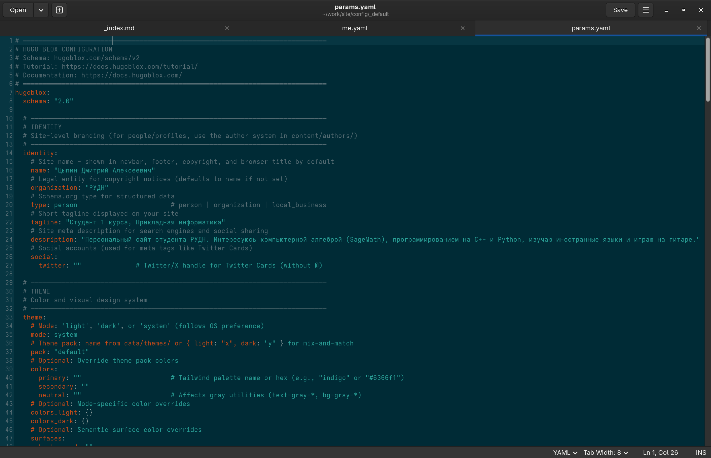{#fig-003 width=90%}

Добавим фото на сайт. Для этого изменим текущее фото на свое - перейдем в папку ~work/site/assents/media/authors и заменим шаблонное фото на свое (рис.4)

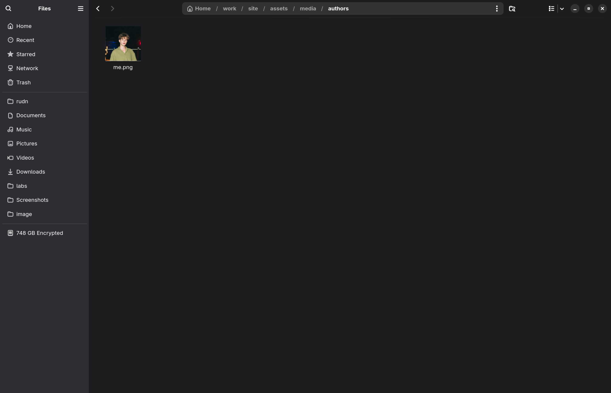{#fig-004 width=90%}

## Написание постов

Для того, чтобы написать посты, нам нужно перейти в директорию ~work/site/content/blog. Изначально там уже есть несколько постов. Я удалил все, кроме одного. Этот один пост я использовал в качестве шаблона.   

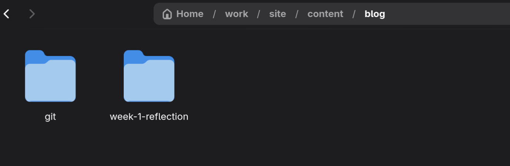{#fig-005 width=90%}

Напишем посты. Тема первого поста - прошедная неделя, тема второго - Управление версиями. Git. Изменяем файлы index.md: пишем в них посты (рис.6, рис.7)

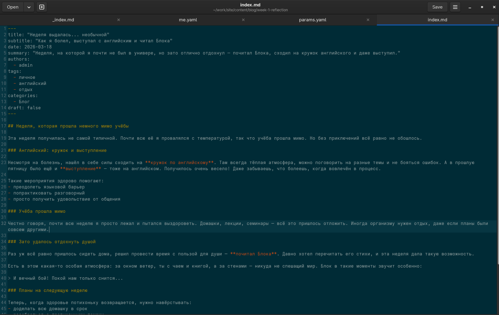{#fig-006 width=90%}

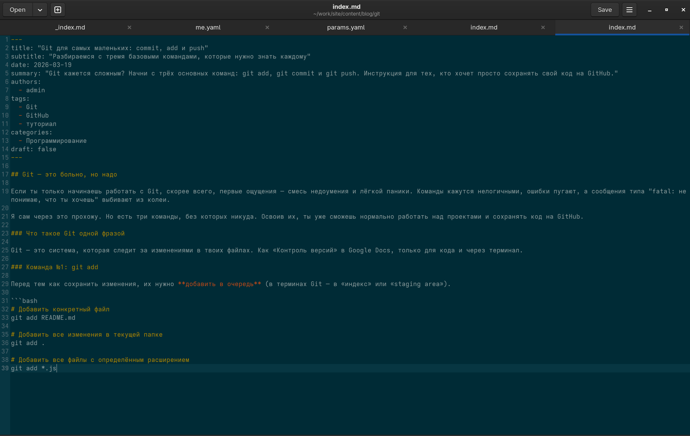{#fig-007 width=90%}\

Для добавления изображений в текущей папке должны лежать фото с названием featured. Для личного поста я оставил фотографию из шаблона, т.к. она подходила под содержание, для поста про гит я скачал фотографию и положил ее в папку (рис.8, рис.9).

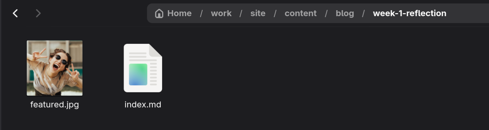{#fig-008 width=90%}

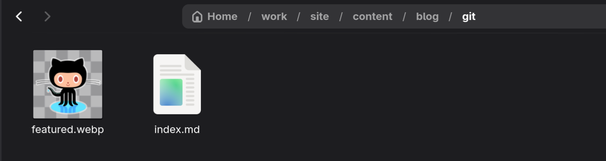{#fig-009 width=90%}

## Запуск сайта

Проверим локально наш сайт. Для этого в терминале перейдем в папку site и запустим сайт локально с помощью hugo server (рис.10) 

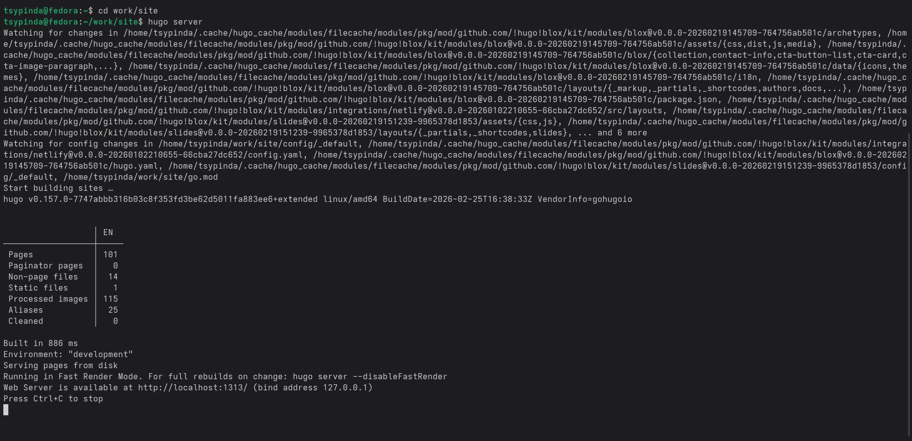{#fig-010 width=90%}

Перейдем по ссылке и проверим правильность сайта (рис.11)

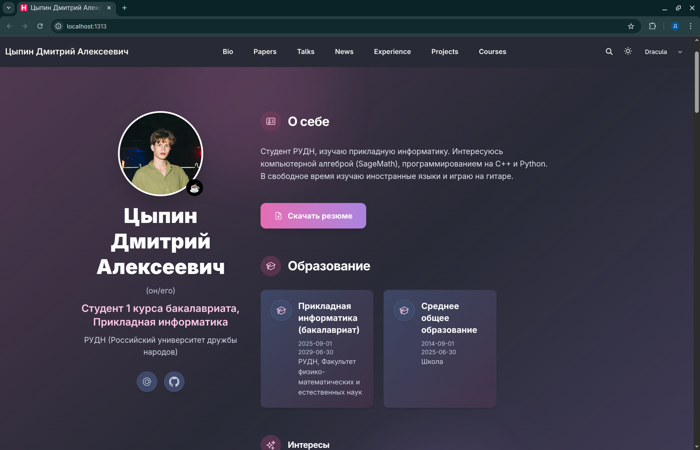{#fig-011 width=90%}

Загрузим сайт на гитхаб (рис.12)

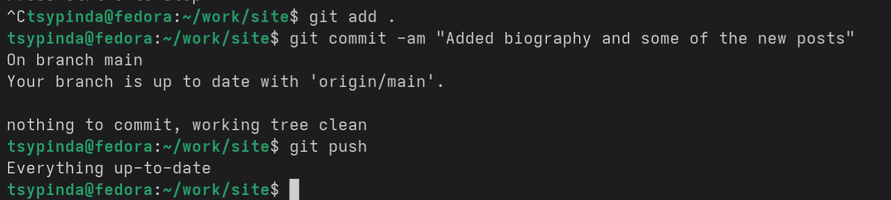{#fig-012 width=90%}

Проверяем сайт. Смотрим биографию и статьи.

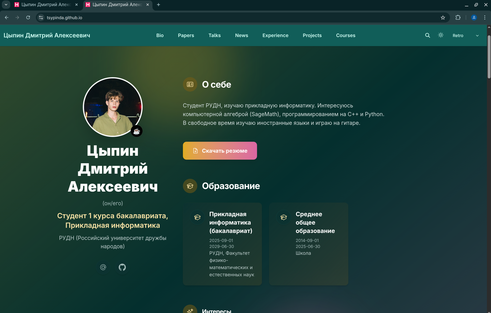{#fig-013 width=90%}

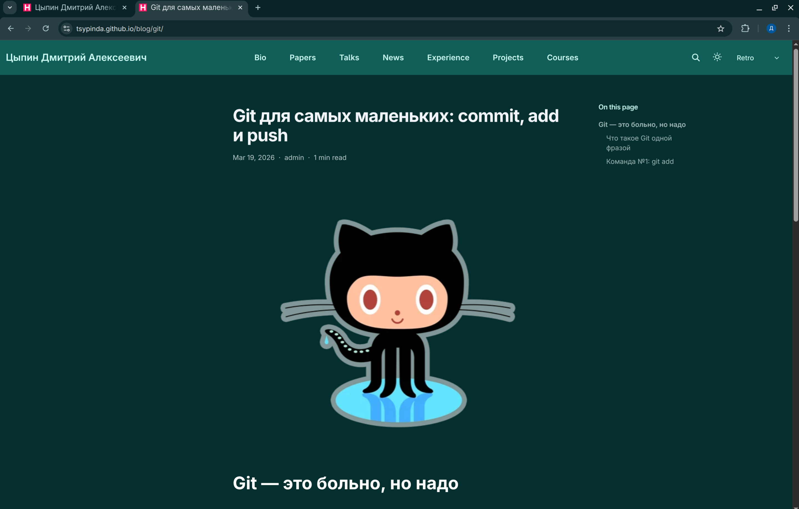{#fig-014 width=90%}

Сайт раотает корректно.

# Выводы

Я разместил персональную информацию на сайте
