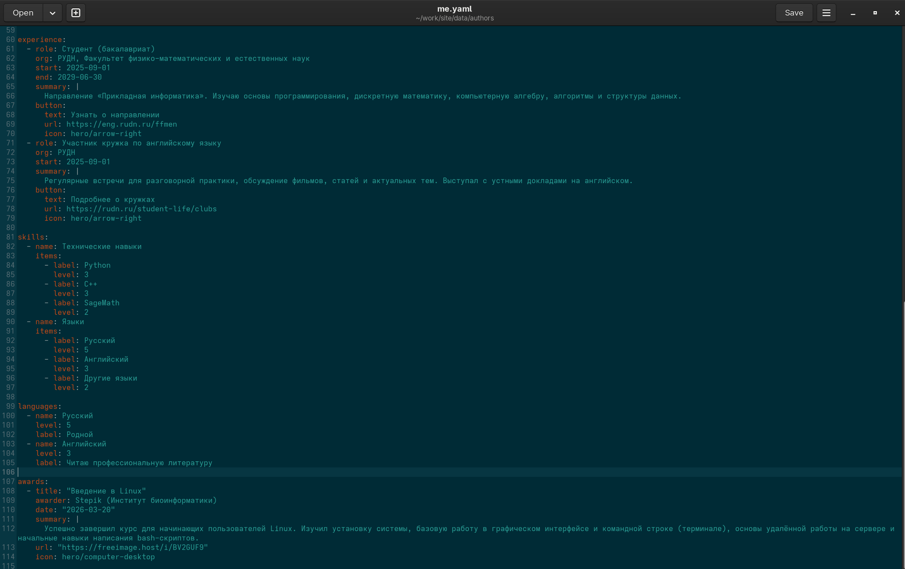
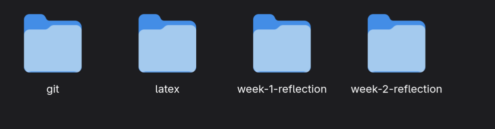
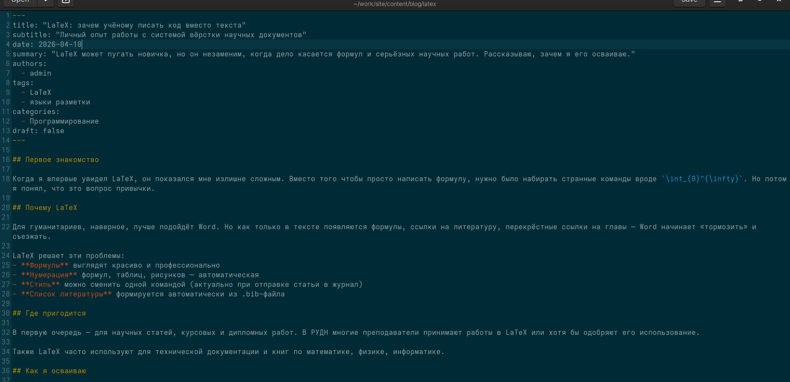
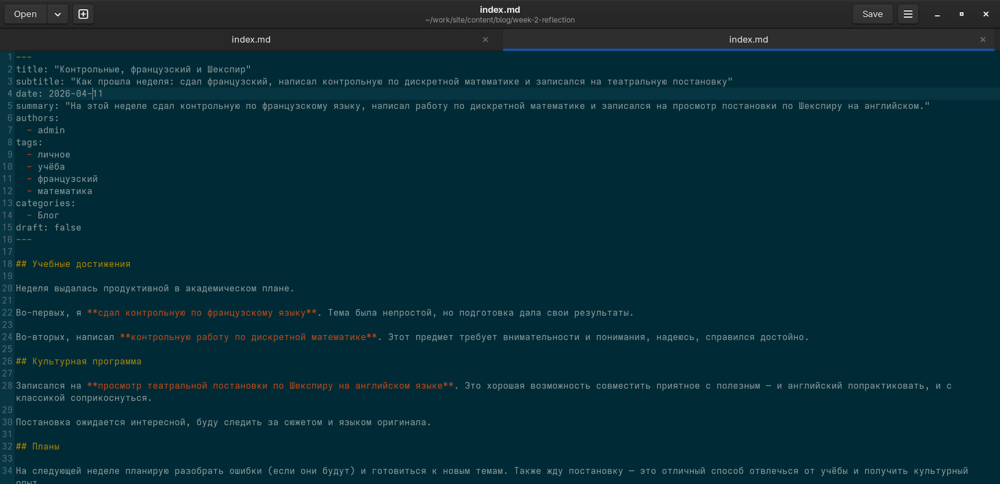
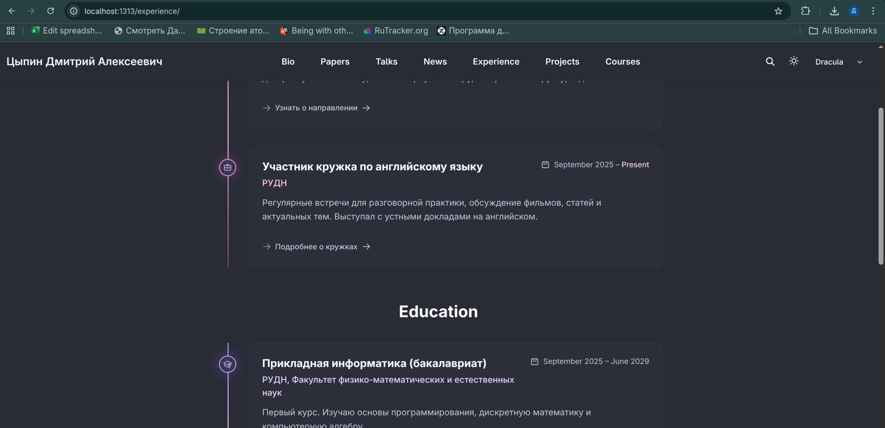
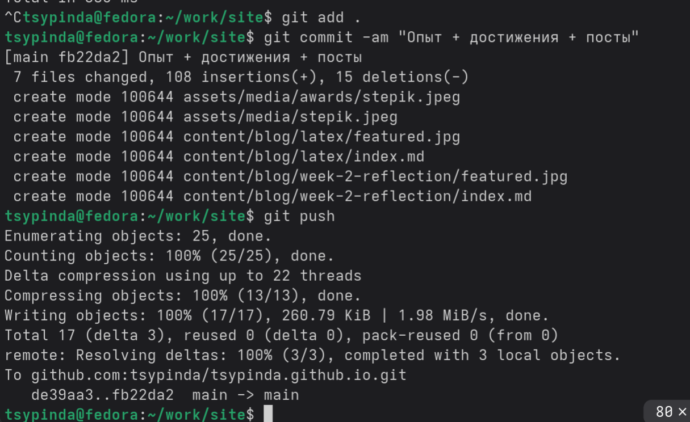
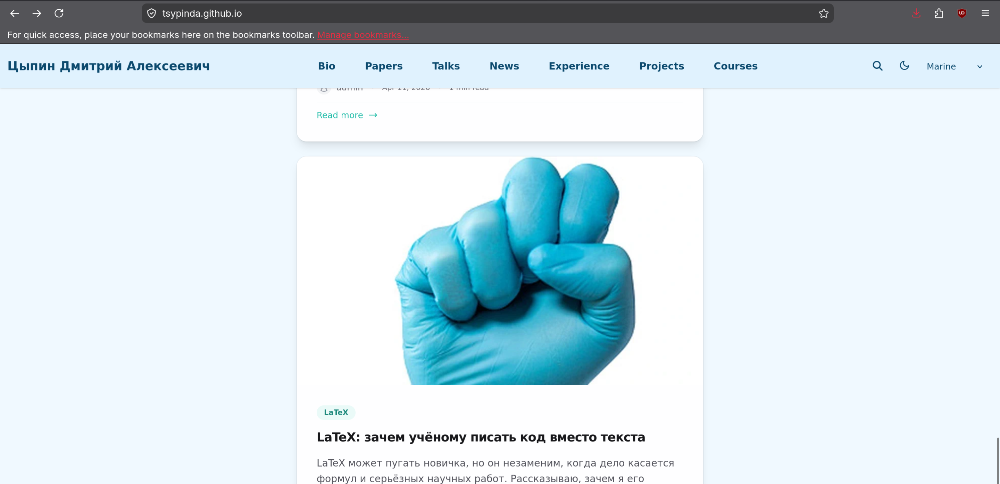
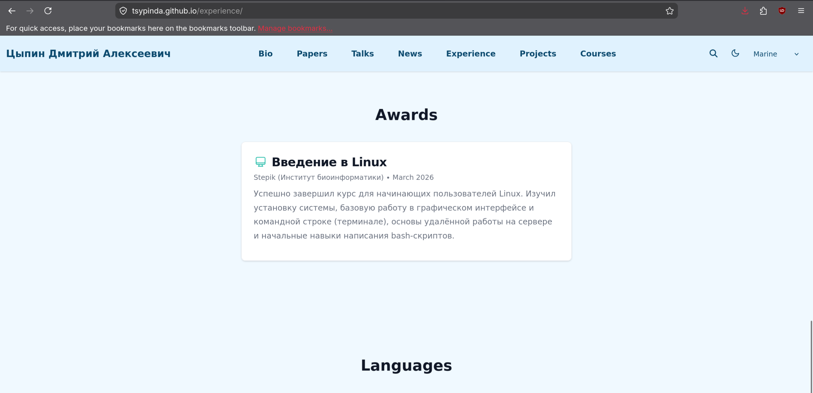

---
## Author
author:
  name: Цыпин Дмитрий Алексеевич, НПИбд-02-25, 1032253633
  degrees: DSc
  orcid: 0000-0002-0877-7063
  email: 1032253633@pfur.ru
  affiliation:
    - name: Российский университет дружбы народов
      country: Российская Федерация
      postal-code: 117198
      city: Москва
      address: ул. Миклухо-Маклая, д. 7

## Title
title: "Второй этап реализации проекта"
subtitle: "Размещение персональной информации на сайт"
license: "CC BY"
---

# Цель работы

Разместить достижения на сайте

# Задание

Добавить к сайту достижения.

    Список достижений.
        Добавить информацию о навыках (Skills).
        Добавить информацию об опыте (Experience).
        Добавить информацию о достижениях (Accomplishments).
    Сделать пост по прошедшей неделе.
    Добавить пост на тему по выбору:
        Легковесные языки разметки.
        Языки разметки. LaTeX.
        Язык разметки Markdown.

# Теоретическое введение

## Техническая реализация проекта

- Для реализации сайта используется генератор статических сайтов Hugo.
- Общие файлы для тем Wowchemy:
-- Репозиторий: https://github.com/wowchemy/wowchemy-hugo-themes
- В качестве шаблона индивидуального сайта используется шаблон Hugo Academic Theme.
-- Демо-сайт: https://academic-demo.netlify.app/
-- Репозиторий: https://github.com/wowchemy/starter-hugo-academic

# Выполнение этапа проектной работы

## Добавление достижений, навыков и опыта работы + прохождение курса на Stepik. Ссылка ведет на сам сертификат. (рис.1)

{#fig-001 width=90%}

## Написание постов

Создадим папки для постов (рис.2)

{#fig-002 width=90%}

Создаем файл index.md, пишем пост про LaTeX (рис.3). Для добавления фотографии перемещаем ее в папку latex и называем featured.jpg 

{#fig-003 width=90%}

Аналогично делаем с недельным постом (рис.4)

{#fig-004 width=90%}

С помощью hugo server запускаем сайт локально и проверяем корректность всего. Сайт работает корректно (рис.5)

{#fig-005 width=90%}

Отправляем на гитхаб, коммитим добавления (рис.6)

{#fig-006 width=90%}

Проверяем работоспособность сайта. Сайт работает корректно (рис.7, рис.8)

{#fig-007 width=90%}

{#fig-008 width=90%}

# Выводы

Я разместил достижения на сайте
